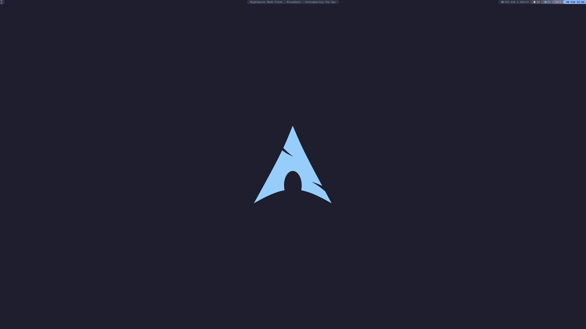
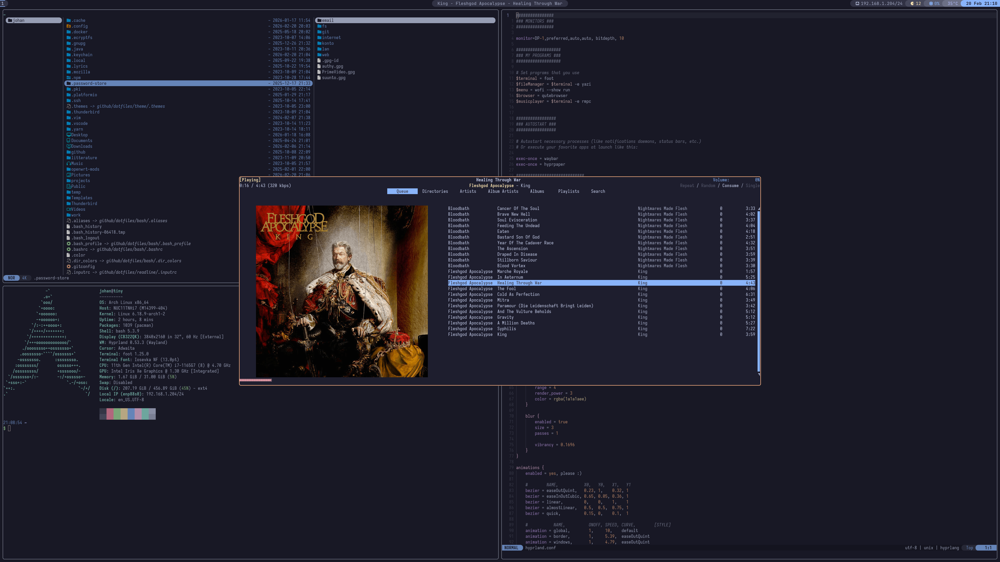

## My Dotfiles

I'm currently trying out [stow][] to manage my dotfiles. There are other alternatives, eg. [bare git][] repos and I've
tried some of the alternatives, but haven't been truly satisfied with any yet so I'm still searching.

To use this, as is, clone this repository into `~/dotfiles` and do

```sh 
cd ~/dotfiles 
stow --restow */ 
```

stow will automatically symlink the contents of each "package" into the parent directory from where it is invoked. 
Usually this will be your home directory, but if it isn't, you can use the `--target` option:

```sh 
cd ~/path/to/dotfiles 
stow --target=$HOME --restow */ 
```

## Currently using...

I'm not the kind of person who keep changing my setup and when I do change something it usually is for a good reason. 
In other words - don't expect frequent changes. When I find something I like, I usually stick with it.

* [archlinux][] - a simple, lightweight linux distribution
* [hyprland][] - a tiling window manager
* [qutebrowser][] - a keyboard-focused browser
* [neovim][] - hyperextensible Vim-based text editor
* [iosevka][] - versatile typeface for code, from code

And this is what it might look like:




[stow]: https://www.gnu.org/software/stow/
[bare git]: https://www.atlassian.com/git/tutorials/dotfiles
[archlinux]: https://archlinux.org/
[hyprland]: https://hypr.land/
[iosevka]: https://github.com/be5invis/Iosevka
[qutebrowser]: https://qutebrowser.org/
[neovim]: https://neovim.io/
